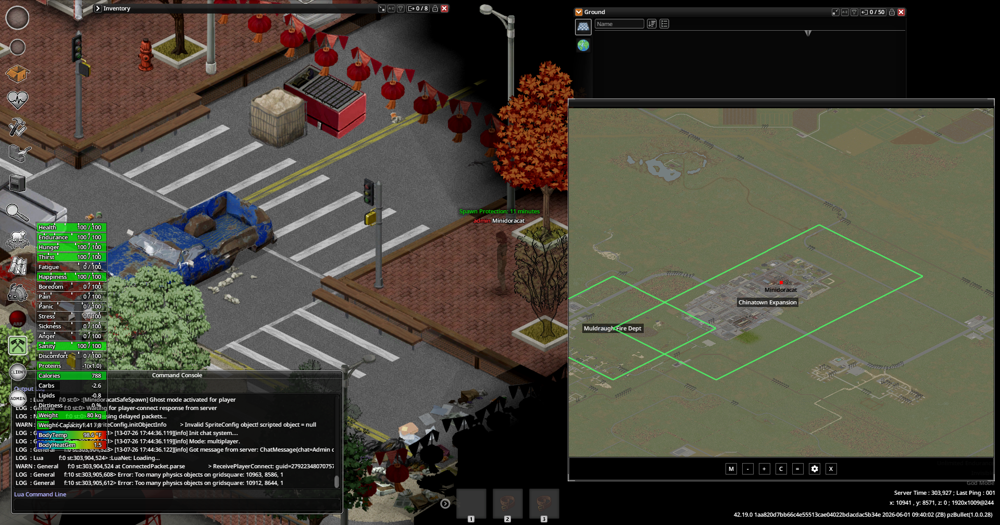

# Minidoracat MiniMap - MOD Maps for B42

**By Minidoracat**

[Minidoracat MiniMap for B42](../MinidoracatMiniMapFor42) 主 MOD 的**地圖包 addon**：
收錄多張地圖 MOD 的小地圖圖像（ImagePyramid）與範圍框線資料，依啟用的地圖 MOD 自動掛載。

- **需要主 MOD**（mod.info `require=MinidoracatMiniMapFor42`）
- 裝了本地圖包後，主 MOD 會多出三個選項（ESC 選項頁／小地圖齒輪）：
  - 顯示 MOD 地圖區塊（掛不掛地圖包圖像）
  - 顯示 MOD 地圖框線（範圍框＋名稱，含四語翻譯）
  - MOD 地圖框線顏色（預設綠，另有青/黃/紫/白）
- 沒裝本地圖包時，上述選項不出現，主 MOD 行為不變

## 截圖



## 收錄地圖

共 **72 張**（57 個 Workshop 項目；亦見 [Steam 收藏](https://steamcommunity.com/sharedfiles/filedetails/?id=3766382352)）。

| 地圖 | 對應 MOD（mod ID) | 範圍（世界 square） |
|------|--------------------|---------------------|
| Muldraugh 消防局 | `beek_muldraugh_firedept` | 10496,8960 – 11008,9472 |
| Estate 39 | `Estate 39` | 8192,9728 – 8704,10240 |
| 唐人街擴張區 | `Chinatown Expansion B42 version`（含 Less Traffic Jam 變體） | 10752,8192 – 11264,9216 |
| 安瑞斯鎮（軍事堡壘） | `AnruisiTown` | 11776,11008 – 13056,12032 |
| 淺草湖畔小鎮 | `Asakusa lake town` | 10496,11264 – 11264,12032 |
| 灰木鎮 | `AshenwoodmodNewB42` | 11264,11008 – 11776,11776 |
| 亞特蘭大安全區（華人社區） | `Atlanta - Safe Zone-Chinese Survivors’ Community` | 8448,7680 – 9216,8448 |
| 亞特蘭大大廈生存 | `Atlanta Tower Survival` | 11008,12544 – 11520,13056 |
| 亞特蘭大 | `Atlanta` | 10496,12288 – 13056,14592 |
| 黑松郡 | `BlackpineCounty` | 9728,14080 – 11776,15360 |
| 卡姆登郡 | `CamdenCountyB42` | 12800,8448 – 19200,14848 |
| 銀杉谷 2.0－公路 | `Cathaya Valley 2.0 B42 version highway` | 7424,12288 – 7936,13312 |
| 銀杉谷 2.0 | `Cathaya Valley 2.0 B42 version` | 7168,12544 – 7680,13312 |
| 康斯鎮 | `Constown42` | 4864,10752 – 6400,11520 |
| 科里爾登 | `CoryerdonB42` | 7168,5632 – 10752,7424 |
| 雛菊郡 | `Daisy County B42 version` | 9728,7168 – 10752,8192 |
| 拂曉鎮 | `dawn_town` | 2816,7936 – 3328,8448 |
| 回音河軍事基地 | `EchoCreek MilitaryBase` | 2816,9984 – 3840,11008 |
| 艾德汽車回收場 | `EdsAutoSalvageB42` | 8448,8192 – 9216,8704 |
| 艾莉卡家具店 | `Erikas_Furniture_Store` | 11264,7936 – 11776,8448 |
| 漂浮烏托邦 | `Floatopia` | 4352,5376 – 4864,5888 |
| 班寧堡 | `FortBenningB42` | 5888,6656 – 6400,7424 |
| 翠湖堡 | `Fort JadeLake` | 11008,8448 – 11520,9216 |
| 濱水堡壘 | `Fort Waterfront B42` | 9984,10752 – 10752,11264 |
| 布恩斯伯勒堡 | `Fort_Boonesborough` | 13824,1792 – 14592,2048 |
| 葡萄籽鎮 | `42Grapeseed` | 6144,10752 – 7680,11776 |
| 綠葉鎮 | `Greenleaf B42 version` | 6144,9984 – 6912,11008 |
| 哈特堡 | `hartburgb42` | 6400,11008 – 6912,11776 |
| 榛果莊園 | `HazelnutManor` | 12544,5888 – 13056,6400 |
| 榛果莊園（簡樸版） | `HazelnutManor[Poor Version]` | 12544,5888 – 13056,6400 |
| 鳶尾島 | `IrisEyot` | 4096,11008 – 4864,11520 |
| 肯塔基中央莊園（翻新） | `Kentucky Center Manor_Renovation` | 7936,9472 – 8448,9984 |
| 落明湖 | `KillMingLake` | 8192,11776 – 8704,12544 |
| 金斯茅斯北區 | `KingsmouthNorthB42` | 0,3840 – 1280,5120 |
| 白森林 | `linzimod` | 8960,11008 – 9728,11776 |
| 小鎮區 | `LittleTownshipB42` | 7936,8192 – 8448,8704 |
| 路易斯維爾河船 | `Louisville_Riverboat` | 13056,1024 – 13312,1280 |
| 巡之丘市（學園孤島） | `Project Gurashi` | 0,2304 – 1280,4864 |
| 美雅鎮 | `Meiya'sTown` | 7936,10752 – 8448,11264 |
| Muldraugh 1993 | `muldraugh1993b42` | 10496,8960 – 11264,11008 |
| Muldraugh 軍事檢查站－天橋 | `Muldraugh-Checkpoint` | 10496,10752 – 11008,11520 |
| 普雷斯頓堡 | `muldraughmilitarybaseas24` | 8448,10752 – 9472,11520 |
| 蕁麻鎮 | `Nettle Township B42 version` | 6400,8960 – 7424,9728 |
| 天頂號郵輪 | `PZ_ACSM_LV` | 12800,768 – 13312,1280 |
| 新煤田鎮 | `PZKNewCoalfieldTownMap` | 2816,8192 – 3584,8960 |
| 浣熊市 | `RaccoonCityB42` | 9728,9728 – 10496,10752 |
| 渡鴉溪 | `RavenCreekB42` | 4096,14336 – 6656,17920 |
| 河畔豪宅（非官方修改版） | `RMSafeHouseUnofficial` | 5376,4864 – 5888,5632 |
| 安泊戍鎮 | `modid` | 11520,10496 – 12800,11520 |
| 途安里 | `SafeWayHamlet` | 12544,10752 – 13056,11520 |
| 7號淪陷區－公路 | `Sector-7 Breach Highway` | 9472,7936 – 10496,9216 |
| 7號淪陷區 | `Sector-7 Breach` | 8960,6400 – 9728,7936 |
| SecretZ 三號地堡 | `Secretz42` | 5888,11520 – 6400,12032 |
| SecretZ 一號檢查站 | `Secretz42` | 11776,7936 – 12544,8448 |
| SecretZ 五號檢查站 | `Secretz42` | 10752,11008 – 11264,11520 |
| SecretZ 六號檢查站 | `Secretz42` | 5632,5632 – 6144,6144 |
| SecretZ 八號檢查站 | `Secretz42` | 6400,11008 – 6912,11520 |
| SecretZ 鹿頭湖基地 | `Secretz42` | 4352,8192 – 4864,8704 |
| SecretZ 路易斯維爾軍事複合區 | `Secretz42` | 13568,1792 – 15360,3072 |
| SecretZ 馬奇嶺研究設施 | `Secretz42` | 9984,11776 – 10752,12800 |
| SecretZ 火車站難民營 | `Secretz42` | 11264,9472 – 12032,10752 |
| SecretZ 十字路口檢查站 | `Secretz42` | 10496,11008 – 11008,11520 |
| SecretZ 北方檢查站 | `Secretz42` | 3584,6656 – 4352,7424 |
| SecretZ 購物中心 | `Secretz42` | 13568,5632 – 14336,6144 |
| 台北路 | `Taibeiroad4` | 7936,9984 – 9216,11776 |
| 泰勒斯維爾 | `Taylorsville` | 8960,6144 – 10496,7680 |
| 提基鎮＆發電廠 | `tikitown` | 6400,6656 – 7936,7936 |
| 特拉帕湖鎮 | `TrapalaketownB42` | 8192,11520 – 9216,12032 |
| Z 村 | `VilaZMap` | 9472,9472 – 9984,9984 |
| 西點擴張區 | `WestPointExpansionB42` | 11776,6400 – 13312,7680 |
| 斯皮福堡（WILDSTEEL） | `WILDSTEEL` | 14336,5632 – 14848,6144 |
| 柳溪堡壘 | `Willowbrook Bastion!` | 8448,9472 – 9728,10240 |

## 專案結構

```
MinidoracatMiniMapModMapsFor42/
├── STEAM_DESCRIPTION.md           # Steam 商店頁描述（中文）——改動時必同步 _EN / _JP 版
├── link_workshop.bat              # Workshop 符號連結管理（雙擊啟動）
├── PZ_Test.bat                    # PZ 本地測試啟動器（雙擊啟動）
├── scripts/                       # PowerShell 腳本
└── MOD/MinidoracatMiniMapModMapsFor42/Contents/mods/MinidoracatMiniMapModMapsFor42/42/
    ├── mod.info                   # require=MinidoracatMiniMapFor42
    └── media/
        ├── lua/client/MinidoracatMiniMapModMaps.lua   # 向主 MOD 註冊地圖清單
        ├── lua/shared/Translate/{CH,CN,EN,JP}/UI.json
        └── minimap/               # pyramid zip（渲染產物，不進版控）
```

## 授權

程式碼與設定以 [MIT License](LICENSE) 釋出。地圖圖像（pyramid.zip）不進版控；
其內容衍生自 Project Zomboid 遊戲資產與第三方地圖 MOD，發佈規範見上方授權清單。

## 新增支援地圖

1. pzmap Studio 選該地圖 MOD →「遊戲內小地圖」模式輸出 `<地圖名>.pyramid.zip`
   （預設輸出名，免改名）放進 `media/minimap/`
2. `MinidoracatMiniMapModMaps.lua` 註冊清單加一行（bounds 抄渲染輸出 pyramid.txt）
3. `Translate/*/UI.json` 加地圖名翻譯鍵

